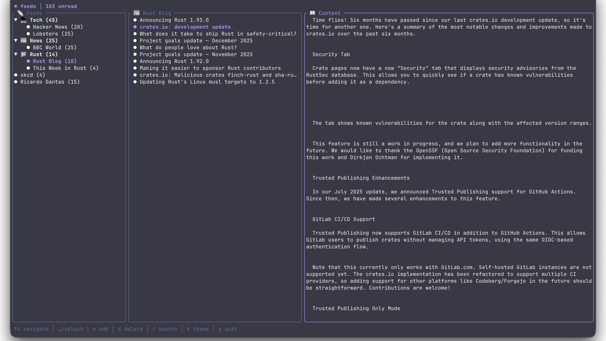
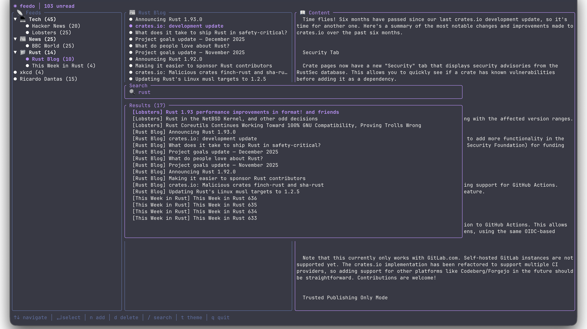
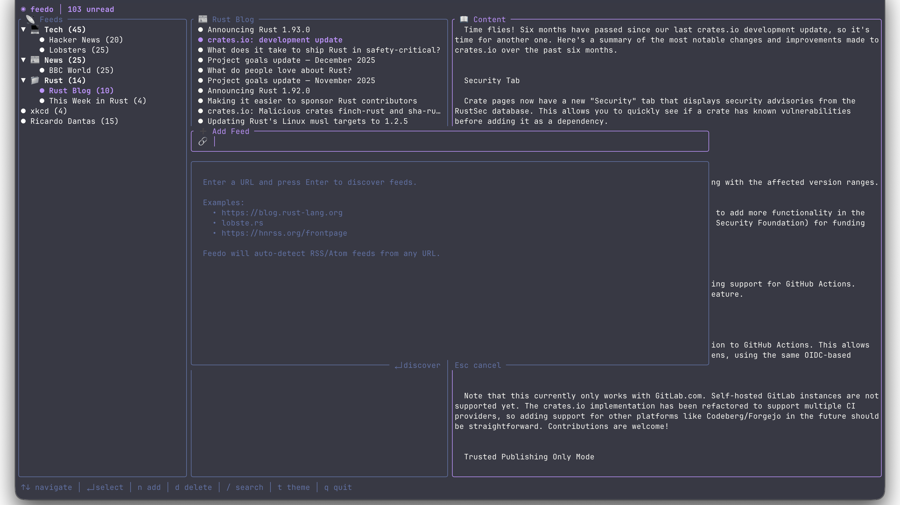

<p align="center">
  <pre>
      ██████╗██████╗██████╗██████╗  ██████╗
      ██╔═══╝██╔═══╝██╔═══╝██╔══██╗██╔═══██╗
      █████╗ █████╗ █████╗ ██║  ██║██║   ██║
      ██╔══╝ ██╔══╝ ██╔══╝ ██║  ██║██║   ██║
      ██║    ██████╗██████╗██████╔╝╚██████╔╝
      ╚═╝    ╚═════╝╚═════╝╚═════╝  ╚═════╝ 
  </pre>
  <br>
  <b>(◕ᴥ◕) Your terminal RSS companion</b>
  <br><br>
  <a href="#installation">Installation</a> •
  <a href="#features">Features</a> •
  <a href="#usage">Usage</a> •
  <a href="#configuration">Configuration</a> •
  <a href="#keybindings">Keybindings</a>
</p>

---

A **beautiful**, **fast**, and **modern** terminal RSS reader built with Rust.  
Think [Reeder](https://reederapp.com/) meets the command line.

<br>

## 📸 Screenshots

### Main View

*Three-panel layout: feeds, articles, and content preview with Dracula theme*

### Search

*Real-time search across all your feeds*

### Add Feed

*Auto-discover RSS/Atom feeds from any URL*

<br>

## ✨ Features

| Feature | Description |
|---------|-------------|
| 🎨 **Beautiful TUI** | Clean three-panel interface with rounded borders and smooth navigation |
| 🔍 **Feed Discovery** | Auto-detect RSS/Atom feeds from any URL — just paste a website |
| 📴 **Offline Mode** | Articles cached locally — read without internet, read states persist |
| 📁 **Smart Folders** | Organize feeds into collapsible folders with custom emoji icons |
| 🔎 **Instant Search** | Find articles across all feeds with real-time filtering |
| 🎭 **15 Themes** | Dracula, Nord, Catppuccin, Gruvbox, Tokyo Night, Solarized, and more |
| 📥 **OPML Support** | Import/export subscriptions for easy migration |
| ⚡ **Blazingly Fast** | Async feed fetching with Tokio — no UI blocking |
| 🦀 **Memory Safe** | Written in 100% safe Rust with zero unsafe code |
| 🌍 **Cross-Platform** | Linux, macOS, Windows — same config path everywhere |

## 🚀 Installation

### Homebrew (macOS/Linux)

```bash
brew install ricardodantas/tap/feedo
```

### Cargo (All Platforms)

```bash
cargo install feedo
```

### From Source

```bash
# Clone the repository
git clone https://github.com/ricardodantas/feedo.git
cd feedo

# Build with optimizations
cargo build --release

# Run it!
./target/release/feedo
```

### Pre-built Binaries

Download from [GitHub Releases](https://github.com/ricardodantas/feedo/releases) — available for Linux (x64, ARM64, musl), macOS (Intel, Apple Silicon), and Windows.

### Requirements

- A terminal with Unicode support
- That's it!

<br>

## 📖 Usage

### Basic Commands

```bash
# Launch the TUI
feedo

# Import feeds from another reader
feedo --import subscriptions.opml

# Backup your feeds
feedo --export backup.opml

# Show help
feedo --help
```

### Adding Feeds

Press `n` in the app to add a new feed. Just paste any URL — Feedo will auto-discover the RSS/Atom feed:

```
┌─ ➕ Add Feed ──────────────────────────────────────────┐
│ 🔗 https://blog.rust-lang.org│                        │
└───────────────────────────────────────────────────────┘
```

Feedo tries:
1. The URL directly (if it's already a feed)
2. `<link rel="alternate">` tags in HTML
3. Common paths like `/feed`, `/rss`, `/atom.xml`

### First Run

On first launch, Feedo creates a default configuration with some starter feeds:
- **Tech**: Hacker News, Lobsters
- **News**: BBC World

Feel free to modify `~/.config/feedo/config.json` to add your own!

<br>

## ⌨️ Keybindings

### Navigation

| Key | Action |
|-----|--------|
| `j` / `↓` | Move down |
| `k` / `↑` | Move up |
| `l` / `→` / `Enter` | Select / Enter |
| `h` / `←` | Go back |
| `g` | Jump to top |
| `G` | Jump to bottom |
| `Tab` | Switch between panels |

### Actions

| Key | Action |
|-----|--------|
| `n` | Add new feed (with auto-discovery) |
| `d` / `Delete` | Delete selected feed |
| `r` | Refresh all feeds |
| `o` | Open article in browser |
| `Space` | Toggle read/unread |
| `a` | Mark all as read |
| `/` | Open search |
| `t` | Open theme picker |
| `q` / `Esc` | Quit |

### Add Feed Mode

| Key | Action |
|-----|--------|
| `Enter` | Discover feeds / Confirm |
| `↑` / `↓` | Select feed (if multiple found) |
| `Esc` | Cancel / Go back |

### Search Mode

| Key | Action |
|-----|--------|
| `Enter` | Go to selected result |
| `↑` / `↓` | Navigate results |
| `Esc` | Cancel search |

### Theme Picker

| Key | Action |
|-----|--------|
| `↑` / `↓` | Browse themes (live preview) |
| `Enter` | Apply and save theme |
| `Esc` | Cancel |

<br>

## ⚙️ Configuration

### Config Location

Feedo uses `~/.config/feedo/` on **all platforms** for consistency:

| Platform | Path |
|----------|------|
| Linux | `~/.config/feedo/config.json` |
| macOS | `~/.config/feedo/config.json` |
| Windows | `%USERPROFILE%\.config\feedo\config.json` |

### Example Configuration

```json
{
  "folders": [
    {
      "name": "Tech",
      "icon": "💻",
      "expanded": true,
      "feeds": [
        {
          "name": "Hacker News",
          "url": "https://hnrss.org/frontpage"
        },
        {
          "name": "Lobsters",
          "url": "https://lobste.rs/rss"
        },
        {
          "name": "This Week in Rust",
          "url": "https://this-week-in-rust.org/rss.xml"
        }
      ]
    },
    {
      "name": "News",
      "icon": "📰",
      "expanded": false,
      "feeds": [
        {
          "name": "BBC World",
          "url": "https://feeds.bbci.co.uk/news/world/rss.xml"
        }
      ]
    }
  ],
  "feeds": [
    {
      "name": "xkcd",
      "url": "https://xkcd.com/rss.xml"
    }
  ],
  "theme": {
    "name": "dracula"
  },
  "refresh_interval": 30
}
```

### Offline Mode & Cache

Feedo automatically caches all articles for offline reading:

| File | Purpose |
|------|---------|
| `~/.config/feedo/data/cache.json` | Cached articles and read states |

**How it works:**
- Articles are cached after each successful fetch
- Read/unread states persist between sessions
- When offline, you can still browse all previously fetched articles
- Cache is updated on every refresh and saved on exit

**No configuration needed** — offline mode works automatically!

### Theme Colors

Feedo comes with **15 popular themes** from the terminal/editor world:

| Theme | Description |
|-------|-------------|
| `dracula` | 🦇 Dark purple aesthetic (default) |
| `one-dark-pro` | ⚛️ Atom's iconic dark theme |
| `nord` | ❄️ Arctic, bluish color palette |
| `catppuccin-mocha` | 🐱 Warm pastel dark theme |
| `catppuccin-latte` | ☕ Warm pastel light theme |
| `gruvbox-dark` | 🎸 Retro groove colors |
| `gruvbox-light` | 🌻 Retro groove, light variant |
| `tokyo-night` | 🌃 Futuristic dark blue |
| `solarized-dark` | ☀️ Precision colors, dark |
| `solarized-light` | 🌞 Precision colors, light |
| `monokai-pro` | 🎨 Classic syntax highlighting |
| `rose-pine` | 🌹 Soho vibes with natural pine |
| `kanagawa` | 🌊 Inspired by Hokusai's art |
| `everforest` | 🌲 Comfortable green forest |
| `cyberpunk` | 💜 Neon-soaked futuristic |

**Example config:**
```json
{
  "theme": {
    "name": "catppuccin-mocha"
  }
}
```
| `orange` | 🟠 Energetic |
| `pink` | 🩷 Soft and playful |

<br>

## 🏗️ Architecture

```
src/
├── main.rs              # Entry point, CLI handling
├── lib.rs               # Library root, public API
│
├── app/                 # Application core
│   └── mod.rs           # App state, event loop, orchestration
│
├── config/              # Configuration management
│   ├── mod.rs           # Module exports
│   └── data.rs          # Config structs, load/save logic
│
├── feed/                # Feed management
│   ├── mod.rs           # Module exports  
│   ├── item.rs          # FeedItem struct
│   ├── manager.rs       # FeedManager, Folder, async fetching
│   └── parser.rs        # RSS/Atom parsing with feed-rs
│
├── opml/                # OPML import/export
│   └── mod.rs           # Full OPML 2.0 support
│
├── theme/               # Theming system
│   └── mod.rs           # AccentColor, Theme configuration
│
└── ui/                  # Terminal UI
    ├── mod.rs           # Module exports
    ├── state.rs         # UI state machine
    ├── input.rs         # Keyboard input handling
    ├── render.rs        # Rendering logic, layouts
    └── widgets/         # Custom ratatui widgets
```

### Design Principles

- **Separation of Concerns** — Each module has a single responsibility
- **Async by Default** — Network operations never block the UI
- **Immutable State** — UI state is explicit and predictable
- **Error Propagation** — Errors bubble up with context via `color-eyre`
- **Zero Unsafe** — Memory safety guaranteed by the compiler

<br>

## 🗺️ Roadmap

- [x] **Feed Discovery** — Auto-detect RSS from any URL ✅
- [x] **Offline Mode** — Cache articles for reading without internet ✅
- [ ] **Custom Keybindings** — Vim/Emacs presets, full remapping
- [ ] **Notifications** — Desktop alerts for new articles
- [ ] **Vim Mode** — `:` command mode for power users
- [ ] **Sync** — Optional cloud sync via your own backend
- [ ] **Plugins** — Lua scripting for custom behavior

<br>

## 🤝 Contributing

Contributions are welcome! Please feel free to submit a Pull Request.

1. Fork the repository
2. Create your feature branch (`git checkout -b feature/amazing`)
3. Commit your changes (`git commit -m 'Add amazing feature'`)
4. Push to the branch (`git push origin feature/amazing`)
5. Open a Pull Request

<br>

## 📄 License

MIT © Ricardo Dantas

---

<p align="center">
  <b>Made with ❤️ and 🦀</b>
  <br><br>
  <code>(◕ᴥ◕)</code> Happy reading!
</p>
